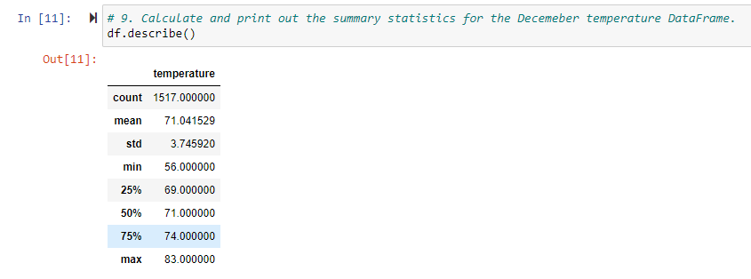
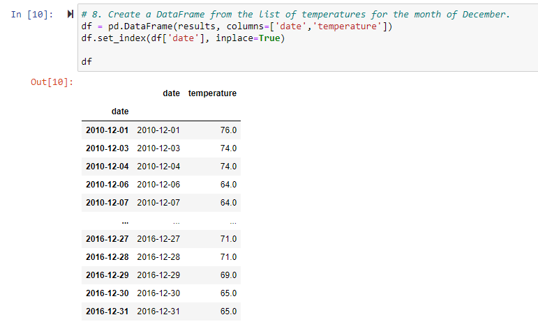

# surfs_up

## Background
W. Avy likes your analysis, but he wants more information about temperature trends before opening the surf shop. Specifically, he wants temperature data for the months of June and December in Oahu, in order to determine if the surf and ice cream shop business is sustainable year-round.

## Overview of Analysis
There are two key points to the challenge. First I have to determine statistics on temperature for the month of June, then do the same for the month of December in Oahu. 
This will provide some insight to the expectations of temperature in at least 2 of the 12 months throughout the year.

## Results

### Visuals
 
*June Statistics*

 
*June Time Frame*

 
*December Statistics* 

 
*December Time Frame*

### Key Diferences
- Total count is the first key difference I noticed. There are 1700 for June which has 30 days, and 1517 for December which has 31 days is a difference in of itself. That would be an average of ~57 readings for each day in June versus ~49 readings for each day in December. This is likely due to the fact that June includes data from 2017 and December does not have data for 2016 even though both have data for 2010. 
- June, a month that is closer to summer, has a minimum temperature of 64 degrees Fahrenheit. December, a month much further from summer, had a minimum of 56 degrees.
- The mean temperature for June is ~75 degrees Fahrenheit and the mean for December is ~71 degrees Fahrenheit. There is a difference of about 4 degrees Fahrenheit
- The standard deviation is higher for December at 3.75 than for June at 3.26. This would mean that in December, the range of temperatures is better spread than that in June.
- June, has a maximum temperature of 85 degrees Fahrenheit while December has a maximum temperature of 83 degrees Fahrenheit.

## Summary

### Summary of analysis
The reality is that there is not much difference between weather in June and December. The mean temperature between both months is 4 degrees where the max temperature is 2 degrees apart and the minimum temperature is 8 degrees apart. Even with the colder days being colder in December, it is still within 10 degrees. It is also unknown at which point the temperature was taken and what time the sun rose and set so these temperature points which could be the reason for a much lower minimum temperature in December when the sun isn't as present throughout the day as it is near summer. During those hours, visitors and residents might not want to be out surfing anyways.

### Other Queries with data available
- The other portion which was partially done during the module, is precipitation. Precipitation might deter visitors and residents from being outdoors regardless of the temperature. Having that data for June and December as well would be useful.
- It would also be useful to include the locations of the station and cross reference with those closer to sea level at the lower elevation and higher elevation might have colder weather which we could exclude.
- It would also be good to have data for both the temperature and precipitation throughout all of the seasons which could vary in this tropical area.

### Other Queries with data that is not available

- If other data such as sun rise and sun set were available, we could see when potential customers such as visitors or residents might be more active and adjust hours of the store.
- It would also be useful to understand the number of visitors Oahu might have throughout the year to figure out how many employees could be needed.

